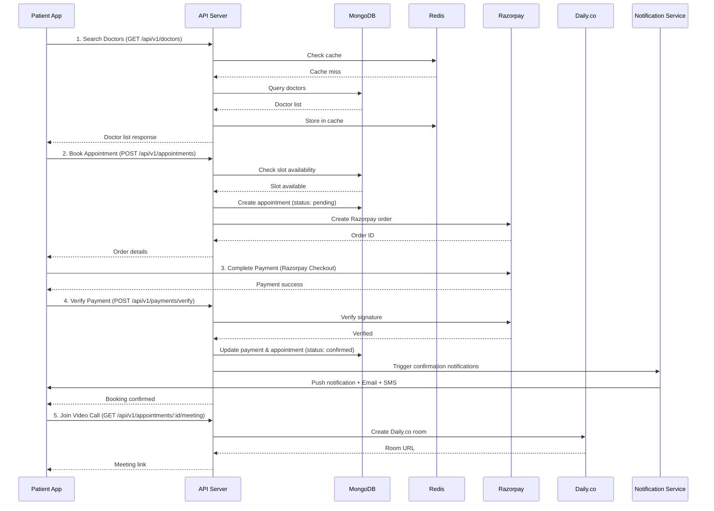
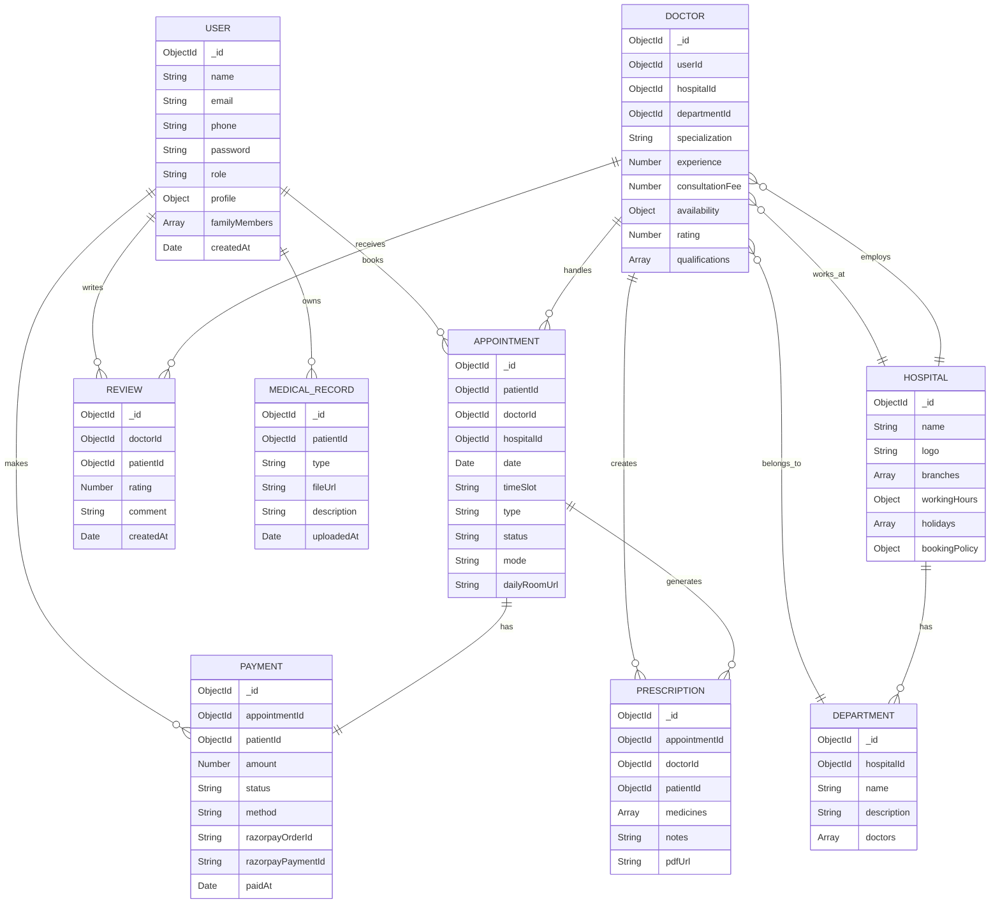

# Software Requirements Specification (SRS)

## Doctor Appointment Booking System

### For Multi-Specialty Hospital

---

| **Field**            | **Details**                                             |
| :------------------- | :------------------------------------------------------ |
| **Document Title**   | Software Requirements Specification (SRS)               |
| **Project Name**     | Doctor Appointment Booking System                       |
| **Version**          | 1.0                                                     |
| **Date**             | August 18, 2026                                         |
| **Status**           | Final — Approved                                        |
| **Prepared By**      | Development Team                                        |
| **Technology Stack** | MERN + TypeScript (MongoDB · Express · React · Node.js) |
| **Architecture**     | Turborepo Monorepo with pnpm Workspaces                 |

---

## Table of Contents

1. [Introduction](#1-introduction)
2. [Overall Description](#2-overall-description)
3. [System Architecture](#3-system-architecture)
4. [Functional Requirements — Patient Application](#4-functional-requirements--patient-application)
5. [Functional Requirements — Admin Application](#5-functional-requirements--admin-application)
6. [Non-Functional Requirements](#6-non-functional-requirements)
7. [Technology Stack & Dependencies](#7-technology-stack--dependencies)
8. [Database Design](#8-database-design)
9. [API Specification](#9-api-specification)
10. [User Interface Requirements](#10-user-interface-requirements)
11. [Security Requirements](#11-security-requirements)
12. [Testing Strategy](#12-testing-strategy)
13. [Deployment & Infrastructure](#13-deployment--infrastructure)
14. [Project Timeline](#14-project-timeline)
15. [Assumptions & Dependencies](#15-assumptions--dependencies)
16. [Glossary](#16-glossary)
17. [Revision History](#17-revision-history)

---

## 1. Introduction

### 1.1 Purpose

This Software Requirements Specification (SRS) document provides a comprehensive description of the **Doctor Appointment Booking System** — an enterprise-grade, production-ready web application designed for multi-specialty hospitals and clinics. It defines the functional and non-functional requirements, system architecture, technology decisions, and implementation standards for the complete system.

This document serves as the single source of truth for all stakeholders — including developers, designers, testers, project managers, and hospital administrators — to ensure alignment throughout the development lifecycle.

### 1.2 Scope

The system comprises **two distinct web applications** built as a unified Turborepo monorepo:

1. **Patient / User Application** — A consumer-facing web app enabling patients to discover doctors, book appointments (in-person & telemedicine), make payments, manage medical records, and attend video consultations.

2. **Hospital / Clinic Admin Application** — A comprehensive administrative dashboard for hospital staff to manage doctors, appointments, patients, departments, financials, analytics, and communications.

Both applications share a single backend API server, shared TypeScript types, validation schemas, and constants.

### 1.3 Intended Audience

| Audience                  | Purpose                                        |
| :------------------------ | :--------------------------------------------- |
| **Developers**            | Technical implementation reference             |
| **Project Managers**      | Scope, timeline, and milestone tracking        |
| **QA / Testers**          | Test case derivation and acceptance criteria   |
| **Hospital Stakeholders** | Feature validation and business alignment      |
| **DevOps Engineers**      | Infrastructure, deployment, and CI/CD planning |

### 1.4 Definitions & Abbreviations

| Abbreviation | Definition                                          |
| :----------- | :-------------------------------------------------- |
| MERN         | MongoDB, Express.js, React, Node.js                 |
| SPA          | Single Page Application                             |
| REST         | Representational State Transfer                     |
| API          | Application Programming Interface                   |
| JWT          | JSON Web Token                                      |
| RBAC         | Role-Based Access Control                           |
| MFA          | Multi-Factor Authentication                         |
| OTP          | One-Time Password                                   |
| UPI          | Unified Payments Interface                          |
| FCM          | Firebase Cloud Messaging                            |
| HIPAA        | Health Insurance Portability and Accountability Act |
| RTK          | Redux Toolkit                                       |
| E2E          | End-to-End                                          |
| CI/CD        | Continuous Integration / Continuous Deployment      |
| CDN          | Content Delivery Network                            |
| GST          | Goods and Services Tax                              |
| PDF          | Portable Document Format                            |
| ODM          | Object Document Mapper                              |
| WSS          | WebSocket Secure                                    |
| LTS          | Long-Term Support                                   |

### 1.5 References

| Reference                | Description                                                    |
| :----------------------- | :------------------------------------------------------------- |
| Implementation Plan v1.0 | Internal technical implementation plan (finalized August 2026) |
| IEEE 830-1998            | IEEE Standard for SRS documentation                            |
| OWASP Top 10 (2025)      | Web application security risks                                 |
| Razorpay API Docs        | Payment gateway integration reference                          |
| Daily.co API Docs        | Video consultation SDK reference                               |

---

## 2. Overall Description

### 2.1 Product Perspective

The Doctor Appointment Booking System is a **greenfield web application** built to digitize and streamline the end-to-end appointment lifecycle for multi-specialty hospitals in India. It replaces manual (phone/walk-in) booking with a digital-first experience while providing hospital administrators with real-time operational intelligence.

The system is designed as a **monorepo** containing three applications (backend server, patient web app, admin web app) sharing a common set of TypeScript types, constants, and validation schemas.

### 2.2 Product Features (High Level)

| #   | Feature Category                    | Patient App | Admin App |
| :-- | :---------------------------------- | :---------: | :-------: |
| 1   | Authentication & Access Control     |     ✅      |    ✅     |
| 2   | Doctor Discovery & Search           |     ✅      |     —     |
| 3   | Appointment Booking & Management    |     ✅      |    ✅     |
| 4   | Payment Processing (Razorpay + UPI) |     ✅      |    ✅     |
| 5   | Telemedicine Video Consultation     |     ✅      |     —     |
| 6   | Medical Records & Prescriptions     |     ✅      |    ✅     |
| 7   | Notifications & Reminders           |     ✅      |    ✅     |
| 8   | Reviews & Ratings                   |     ✅      |    ✅     |
| 9   | Dashboard & Analytics               |      —      |    ✅     |
| 10  | Doctor Management                   |      —      |    ✅     |
| 11  | Patient Management                  |      —      |    ✅     |
| 12  | Department & Specialty Management   |      —      |    ✅     |
| 13  | Financial Management & GST          |      —      |    ✅     |
| 14  | Communication Hub                   |      —      |    ✅     |
| 15  | Hospital Settings & Configuration   |      —      |    ✅     |
| 16  | Reports & Compliance                |      —      |    ✅     |

### 2.3 User Classes & Characteristics

| User Class         | Description                                                                                              | Application |
| :----------------- | :------------------------------------------------------------------------------------------------------- | :---------- |
| **Patient**        | End-user seeking medical consultations. Requires minimal technical literacy. Mobile-first usage pattern. | Patient App |
| **Family Member**  | Dependent user profile managed by a Patient for booking on behalf of children, elderly, etc.             | Patient App |
| **Super Admin**    | Hospital owner/CTO with full system access. Manages all configurations, billing, and staff.              | Admin App   |
| **Admin**          | Hospital manager with access to most features except system-level settings.                              | Admin App   |
| **Receptionist**   | Front-desk staff handling walk-in registrations, appointment management, and queue operations.           | Admin App   |
| **Doctor**         | Medical practitioner viewing their own schedule, patient history, and telemedicine sessions.             | Admin App   |
| **Lab Technician** | Staff managing lab reports and medical records upload.                                                   | Admin App   |

### 2.4 Operating Environment

| Component             | Environment                                                                               |
| :-------------------- | :---------------------------------------------------------------------------------------- |
| **Client (Frontend)** | Modern web browsers — Chrome 120+, Firefox 120+, Safari 17+, Edge 120+ (Desktop & Mobile) |
| **Server (Backend)**  | Node.js 24 LTS runtime on CloudClusters (Linux containers)                                |
| **Database**          | MongoDB 8.3.x (hosted / Atlas)                                                            |
| **Cache & Queue**     | Redis 7.x                                                                                 |
| **CDN / Storage**     | Cloudinary (images, files, PDFs)                                                          |
| **Video**             | Daily.co (HIPAA-compliant video rooms)                                                    |
| **Payments**          | Razorpay (UPI, Cards, Net Banking, Wallets)                                               |

### 2.5 Constraints

| Constraint           | Description                                                               |
| :------------------- | :------------------------------------------------------------------------ |
| **Market**           | Primary target market is India; all payments processed via Razorpay + UPI |
| **Language**         | Full-stack TypeScript is mandatory                                        |
| **State Management** | Redux Toolkit + RTK Query (no Zustand, no TanStack Query)                 |
| **Monorepo**         | Turborepo + pnpm workspaces                                               |
| **Deployment**       | CloudClusters hosting platform                                            |
| **Browser Support**  | No support for IE11 or legacy browsers                                    |

---

## 3. System Architecture

### 3.1 Architecture Diagram

```
┌───────────────────────────────────────────────────────────────┐
│                   TURBOREPO MONOREPO (pnpm)                   │
│                                                               │
│  ┌──────────────────────┐  ┌───────────────────────────────┐ │
│  │ apps/patient          │  │ apps/admin                    │ │
│  │ Vite 8 + React 19     │  │ Vite 8 + React 19            │ │
│  │ TypeScript            │  │ TypeScript                    │ │
│  │ Redux TK + RTK Query  │  │ Redux TK + RTK Query         │ │
│  │ React Router v8       │  │ React Router v8              │ │
│  └───────────┬───────────┘  └──────────────┬────────────────┘ │
│              │                             │                  │
│  ┌───────────┴─────────────────────────────┴────────────────┐ │
│  │              packages/shared (TypeScript)                 │ │
│  │        Types · Constants · Validators (Zod)               │ │
│  └───────────────────────────┬───────────────────────────────┘ │
└──────────────────────────────┼────────────────────────────────┘
                               │  HTTPS / WSS
                               ▼
┌───────────────────────────────────────────────────────────────┐
│                   BACKEND (apps/server)                        │
│                   Node.js 24 LTS + TypeScript                 │
│  ┌────────────────────────────────────────────────────────┐   │
│  │             Express.js 5.2  (REST API)                 │   │
│  │  ┌──────────┐ ┌──────────┐ ┌──────────────────────┐   │   │
│  │  │  Auth    │ │ Booking  │ │  Notifications        │   │   │
│  │  │  Module  │ │  Module  │ │  Module (BullMQ)      │   │   │
│  │  └──────────┘ └──────────┘ └──────────────────────┘   │   │
│  │  ┌──────────┐ ┌──────────┐ ┌──────────────────────┐   │   │
│  │  │ Payment  │ │ Doctor   │ │   Analytics           │   │   │
│  │  │ Razorpay │ │  Module  │ │    Module             │   │   │
│  │  └──────────┘ └──────────┘ └──────────────────────┘   │   │
│  │  ┌──────────┐ ┌──────────┐                            │   │
│  │  │Telemedi- │ │ Admin    │                            │   │
│  │  │cine Daily│ │  Module  │                            │   │
│  │  └──────────┘ └──────────┘                            │   │
│  └─────────┬──────────────┬──────────────┬───────────────┘   │
│            │              │              │                     │
│  ┌─────────▼────────┐ ┌───▼────────┐ ┌──▼──────────────┐     │
│  │  MongoDB 8.3      │ │  Redis 7   │ │ Socket.io 4.8   │     │
│  │  (Mongoose 9.9)   │ │  (BullMQ 6)│ │  (Real-time)    │     │
│  └──────────────────┘ └────────────┘ └─────────────────┘     │
│                                                               │
│  ┌────────────────────────────────────────────────────────┐   │
│  │              External Services                          │   │
│  │  Cloudinary · Razorpay · Daily.co · Nodemailer · FCM   │   │
│  └────────────────────────────────────────────────────────┘   │
└───────────────────────────────────────────────────────────────┘
                               │
                               ▼
                      ┌────────────────┐
                      │  CloudClusters │
                      │  (Deployment)  │
                      └────────────────┘
```

### 3.2 Component Description

| Component              | Technology                   | Responsibility                                      |
| :--------------------- | :--------------------------- | :-------------------------------------------------- |
| **Patient App**        | React 19 + Vite 8 SPA        | Patient-facing booking, payments, telemedicine      |
| **Admin App**          | React 19 + Vite 8 SPA        | Hospital management dashboard                       |
| **Shared Package**     | TypeScript library           | Types, constants, Zod validators shared across apps |
| **API Server**         | Express 5.2 + Node.js 24 LTS | REST API, authentication, business logic            |
| **Primary Database**   | MongoDB 8.3 + Mongoose 9.9   | Persistent data storage                             |
| **Cache / Queue**      | Redis 7 + BullMQ 6           | Caching, session storage, background job queues     |
| **Real-time**          | Socket.io 4.8                | Live appointment status updates, notifications      |
| **File Storage**       | Cloudinary 2.10              | Medical records, profile photos, prescriptions      |
| **Payments**           | Razorpay 2.9                 | UPI, cards, net banking, wallets                    |
| **Video Calls**        | Daily.co                     | HIPAA-compliant telemedicine video rooms            |
| **Email**              | Nodemailer 9.0               | Transactional emails (confirmations, reminders)     |
| **Push Notifications** | Firebase Admin 13.x          | FCM push notifications to mobile browsers           |

### 3.3 Data Flow



---

## 4. Functional Requirements — Patient Application

### 4.1 Authentication & Profile Management

| Req ID   | Requirement                 | Priority | Description                                                                                                                |
| :------- | :-------------------------- | :------- | :------------------------------------------------------------------------------------------------------------------------- |
| FR-P-001 | Email/Password Registration | High     | Patient registers with name, email, password, and phone number. Email verification required.                               |
| FR-P-002 | Email/Password Login        | High     | Authenticated login returning JWT access token + refresh token.                                                            |
| FR-P-003 | Google OAuth Login          | High     | One-click sign-in via Google OAuth 2.0.                                                                                    |
| FR-P-004 | Apple OAuth Login           | Medium   | One-click sign-in via Apple ID.                                                                                            |
| FR-P-005 | OTP Phone Verification      | High     | Phone number verification via 6-digit OTP sent via SMS.                                                                    |
| FR-P-006 | Multi-Factor Authentication | Medium   | Optional MFA via authenticator app or SMS OTP for enhanced security.                                                       |
| FR-P-007 | Forgot Password             | High     | Password reset flow via email link with time-limited token.                                                                |
| FR-P-008 | Reset Password              | High     | Set new password using reset token; invalidate all existing sessions.                                                      |
| FR-P-009 | Profile Management          | High     | Edit personal details — name, age, gender, blood group, allergies, medical history, profile photo.                         |
| FR-P-010 | Profile Photo Upload        | Medium   | Upload and crop profile photo; stored on Cloudinary CDN.                                                                   |
| FR-P-011 | Family Member Profiles      | Medium   | Add/manage dependent profiles (children, elderly) with name, age, gender, relationship. Book appointments on their behalf. |

### 4.2 Doctor Discovery & Search

| Req ID   | Requirement                      | Priority | Description                                                                                                                                       |
| :------- | :------------------------------- | :------- | :------------------------------------------------------------------------------------------------------------------------------------------------ |
| FR-P-012 | Search by Specialty              | High     | Filter doctors by medical specialty (Cardiology, Orthopedics, Dermatology, Pediatrics, Gynecology, Neurology, Ophthalmology, etc.).               |
| FR-P-013 | Search by Name/Location/Hospital | High     | Free-text search across doctor name, hospital name, and location/city.                                                                            |
| FR-P-014 | Advanced Filters                 | High     | Filter by years of experience, rating range, consultation fee range, available dates, languages spoken.                                           |
| FR-P-015 | Doctor Profile View              | High     | Detailed doctor page showing education, certifications, experience, consultation fee, available slots, reviews, photos, and hospital affiliation. |
| FR-P-016 | AI Symptom Checker               | Low      | Patient describes symptoms in natural language; AI suggests the most appropriate medical specialty.                                               |
| FR-P-017 | Real-time Availability           | Medium   | Live indicator showing whether a doctor is currently available, busy, or offline. Updated via Socket.io.                                          |

### 4.3 Appointment Booking

| Req ID   | Requirement                   | Priority | Description                                                                                                                  |
| :------- | :---------------------------- | :------- | :--------------------------------------------------------------------------------------------------------------------------- |
| FR-P-018 | View Available Slots          | High     | Calendar view displaying available time slots for a selected doctor on a chosen date. Slots shown in 15/30-minute intervals. |
| FR-P-019 | Book In-Person Appointment    | High     | Select a slot, choose "In-Person" mode, confirm and proceed to payment.                                                      |
| FR-P-020 | Book Telemedicine Appointment | High     | Select a slot, choose "Video Consultation" mode, confirm and proceed to payment. Daily.co room auto-created.                 |
| FR-P-021 | Instant Booking               | High     | Confirmed immediately upon successful payment for doctors who allow instant booking.                                         |
| FR-P-022 | Request-Based Booking         | Medium   | For select doctors, appointment requires admin/doctor approval after payment hold.                                           |
| FR-P-023 | Appointment Confirmation      | High     | Post-booking confirmation screen showing doctor name, date, time, mode, payment receipt, and meeting link (if telemedicine). |
| FR-P-024 | Reschedule Appointment        | High     | Reschedule to a new slot within the hospital's cancellation policy window. Original slot released.                           |
| FR-P-025 | Cancel Appointment            | High     | Cancel appointment with automatic refund processing per hospital policy (full/partial/no refund based on timing).            |
| FR-P-026 | Waitlist                      | Medium   | Join waitlist for a fully-booked doctor. Auto-notify via push notification when a slot opens.                                |
| FR-P-027 | Recurring Appointments        | Low      | Book follow-up appointments at regular intervals (weekly/bi-weekly/monthly).                                                 |

### 4.4 Payments (Razorpay + UPI)

| Req ID   | Requirement              | Priority | Description                                                                                                        |
| :------- | :----------------------- | :------- | :----------------------------------------------------------------------------------------------------------------- |
| FR-P-028 | Consultation Fee Display | High     | Show doctor's consultation fee on their profile and during booking. Differentiate in-person vs. telemedicine fees. |
| FR-P-029 | Razorpay Checkout        | High     | Integrated Razorpay payment modal supporting UPI, Credit/Debit Cards, Net Banking, and Wallets.                    |
| FR-P-030 | UPI Payment              | High     | Direct UPI payment via apps (Google Pay, PhonePe, Paytm, etc.) or UPI ID.                                          |
| FR-P-031 | Payment Verification     | High     | Server-side verification of Razorpay payment signature to prevent tampering.                                       |
| FR-P-032 | Payment History          | High     | Chronological list of all payments with status (success, failed, refunded), amount, date, and doctor name.         |
| FR-P-033 | Invoice Download         | High     | Download PDF invoice/receipt for each completed payment containing GST details.                                    |
| FR-P-034 | Refund Management        | High     | Automated refund to original payment method upon eligible cancellation. Refund status tracking.                    |
| FR-P-035 | Insurance Info           | Low      | Display insurance claim assistance information and links (informational, not transactional).                       |

### 4.5 Notifications & Reminders

| Req ID   | Requirement                | Priority | Description                                                                                                               |
| :------- | :------------------------- | :------- | :------------------------------------------------------------------------------------------------------------------------ |
| FR-P-036 | Push Notifications         | High     | Browser push notifications via FCM for appointment confirmations, reminders, cancellations, and slot availability alerts. |
| FR-P-037 | Email Notifications        | High     | Transactional emails for booking confirmation, reminders, cancellation, payment receipts, and password resets.            |
| FR-P-038 | SMS Reminders              | High     | Automated SMS sent 24 hours and 1 hour before the appointment time.                                                       |
| FR-P-039 | In-App Notification Center | Medium   | Bell icon with unread badge; scrollable notification feed with read/unread states and timestamps.                         |

### 4.6 Telemedicine / Video Consultation (Daily.co)

| Req ID   | Requirement       | Priority | Description                                                                                                                         |
| :------- | :---------------- | :------- | :---------------------------------------------------------------------------------------------------------------------------------- |
| FR-P-040 | Video Call        | High     | HIPAA-compliant video call using Daily.co Prebuilt UI. Auto-joins when patient clicks "Join Consultation" within their appointment. |
| FR-P-041 | In-Call Chat      | Medium   | Text chat between patient and doctor during the video consultation.                                                                 |
| FR-P-042 | File Sharing      | Medium   | Upload and share images/documents (lab reports, prescriptions) within the video call chat interface.                                |
| FR-P-043 | Screen Share      | Low      | Patient can share their screen to display reports or documents to the doctor.                                                       |
| FR-P-044 | Auto Meeting Link | High     | Meeting link auto-generated when a telemedicine appointment is confirmed. Link visible in appointment details.                      |

### 4.7 Medical Records & Prescriptions

| Req ID   | Requirement            | Priority | Description                                                                                                             |
| :------- | :--------------------- | :------- | :---------------------------------------------------------------------------------------------------------------------- |
| FR-P-045 | Appointment History    | High     | Chronological list of all past and upcoming appointments with status, doctor name, date, and mode.                      |
| FR-P-046 | Digital Prescriptions  | High     | View e-prescriptions issued by doctors post-consultation. Contains medicine names, dosage, frequency, and doctor notes. |
| FR-P-047 | Upload Medical Records | Medium   | Upload lab reports, scans, and documents (JPEG, PNG, PDF). Stored on Cloudinary. Tagged by type and date.               |
| FR-P-048 | Download/Share Records | Medium   | Download medical records and prescriptions as PDF. Share via email or link.                                             |
| FR-P-049 | Health Timeline        | Low      | Visual timeline showing all medical events (appointments, prescriptions, record uploads) chronologically.               |

### 4.8 Reviews & Feedback

| Req ID   | Requirement     | Priority | Description                                                                                                 |
| :------- | :-------------- | :------- | :---------------------------------------------------------------------------------------------------------- |
| FR-P-050 | Rate Doctor     | Medium   | Post-appointment star rating (1–5) with optional text review. Only permitted after a completed appointment. |
| FR-P-051 | View Reviews    | High     | Display aggregated rating and paginated reviews on doctor profile page.                                     |
| FR-P-052 | Report Review   | Low      | Flag inappropriate or spam reviews for admin moderation.                                                    |
| FR-P-053 | Hospital Rating | Low      | Rate the overall hospital/clinic experience.                                                                |

### 4.9 Miscellaneous

| Req ID   | Requirement           | Priority | Description                                                                         |
| :------- | :-------------------- | :------- | :---------------------------------------------------------------------------------- |
| FR-P-054 | Dark/Light Mode       | Medium   | User-toggleable dark and light theme. Persists across sessions via localStorage.    |
| FR-P-055 | Multi-Language (i18n) | Medium   | Support for multiple languages (English, Hindi, Tamil, Telugu, etc.) using i18next. |
| FR-P-056 | Help & Support        | Low      | FAQ section, contact form, and support email/phone details.                         |
| FR-P-057 | Emergency SOS         | Low      | Quick-access button linking to local emergency services / ambulance number.         |
| FR-P-058 | Health Tips / Blog    | Low      | Curated health articles and tips displayed on the home page.                        |

---

## 5. Functional Requirements — Admin Application

### 5.1 Authentication & Access Control

| Req ID   | Requirement        | Priority | Description                                                                                                                           |
| :------- | :----------------- | :------- | :------------------------------------------------------------------------------------------------------------------------------------ |
| FR-A-001 | Admin Registration | High     | Hospital admin registers with hospital details. Requires verification before access is granted.                                       |
| FR-A-002 | RBAC               | High     | Role-Based Access Control with 5 roles: Super Admin, Admin, Receptionist, Doctor, Lab Technician. Each role has granular permissions. |
| FR-A-003 | Team Invitation    | High     | Invite team members via email with pre-assigned role. Invited user sets their own password.                                           |
| FR-A-004 | Audit Logs         | High     | Immutable log of all significant actions (login, data modification, deletion) with timestamp, user ID, action, and IP address.        |

### 5.2 Dashboard & Analytics

| Req ID   | Requirement          | Priority | Description                                                                                                                                       |
| :------- | :------------------- | :------- | :------------------------------------------------------------------------------------------------------------------------------------------------ |
| FR-A-005 | Real-time Dashboard  | High     | Overview showing today's appointment count, total revenue, active patients, pending appointments, and no-show rate. Auto-refreshed via Socket.io. |
| FR-A-006 | Revenue Analytics    | High     | Interactive charts (bar, line, pie) showing revenue trends — daily, weekly, monthly, yearly. Filterable by doctor, department, branch.            |
| FR-A-007 | Doctor Performance   | Medium   | Metrics per doctor: appointments handled, average rating, no-show rate, revenue generated, and patient feedback summary.                          |
| FR-A-008 | Patient Demographics | Medium   | Charts showing patient age distribution, gender ratio, top specialties sought, and geographic distribution.                                       |
| FR-A-009 | Department Analytics | Medium   | Performance metrics per department: appointment volume, revenue, doctor utilization rate.                                                         |
| FR-A-010 | Trend Forecasting    | Low      | Predictive chart showing expected appointment volume for the next 30 days based on historical data.                                               |
| FR-A-011 | Exportable Reports   | High     | Export any report or analytics view as CSV, Excel, or PDF.                                                                                        |

### 5.3 Doctor Management

| Req ID   | Requirement           | Priority | Description                                                                                                   |
| :------- | :-------------------- | :------- | :------------------------------------------------------------------------------------------------------------ |
| FR-A-012 | Add Doctor            | High     | Create doctor profile with name, specialization, qualifications, experience, photo, bio, and contact details. |
| FR-A-013 | Edit Doctor           | High     | Update any doctor profile field. Changes reflected immediately on the patient app.                            |
| FR-A-014 | Remove Doctor         | High     | Soft-delete a doctor. All future appointments auto-cancelled with patient notification.                       |
| FR-A-015 | Set Availability      | High     | Configure weekly schedule (day-wise working hours + break times). Support for different schedules per day.    |
| FR-A-016 | Leave Management      | Medium   | Mark doctor as unavailable for specific dates. Block slot generation for leave days.                          |
| FR-A-017 | Set Consultation Fees | High     | Configure in-person and telemedicine consultation fees separately.                                            |
| FR-A-018 | Department Assignment | High     | Assign doctor to one or more departments.                                                                     |
| FR-A-019 | Doctor Onboarding     | Medium   | Step-by-step wizard for adding a new doctor — profile, documents, schedule, fee setup.                        |

### 5.4 Appointment Management

| Req ID   | Requirement         | Priority | Description                                                                                                                                           |
| :------- | :------------------ | :------- | :---------------------------------------------------------------------------------------------------------------------------------------------------- |
| FR-A-020 | Calendar View       | High     | Interactive calendar (FullCalendar) showing all appointments. Day, week, and month views. Color-coded by status.                                      |
| FR-A-021 | List View           | High     | Tabular appointment list with sortable columns and search.                                                                                            |
| FR-A-022 | Filter Appointments | High     | Filter by doctor, department, status (pending, confirmed, in-progress, completed, cancelled, no-show), date range, and mode (in-person/telemedicine). |
| FR-A-023 | Walk-in Appointment | High     | Receptionist creates appointment for walk-in patients without requiring online payment.                                                               |
| FR-A-024 | Approve/Reject      | Medium   | For request-based bookings, admin/doctor can approve or reject with reason.                                                                           |
| FR-A-025 | Reschedule          | High     | Admin can reschedule any appointment. Patient notified automatically.                                                                                 |
| FR-A-026 | Cancel              | High     | Admin can cancel any appointment. Refund processed per policy. Patient notified.                                                                      |
| FR-A-027 | Status Transition   | High     | Update appointment status: Pending → Confirmed → In-Progress → Completed or No-Show.                                                                  |
| FR-A-028 | Waitlist Management | Medium   | View and manage waitlisted patients per doctor. Auto-assign when slots open.                                                                          |
| FR-A-029 | Queue Management    | Medium   | Token number generation for walk-in patients. Display current token on a status screen.                                                               |

### 5.5 Patient Management

| Req ID   | Requirement          | Priority | Description                                                                                  |
| :------- | :------------------- | :------- | :------------------------------------------------------------------------------------------- |
| FR-A-030 | Patient Directory    | High     | Searchable, paginated list of all registered patients with contact details and visit count.  |
| FR-A-031 | Patient History      | High     | View complete appointment history, prescriptions, and medical records for any patient.       |
| FR-A-032 | Walk-in Registration | High     | Register new patient at reception without requiring the patient to create an online account. |
| FR-A-033 | Merge Duplicates     | Low      | Identify and merge duplicate patient records based on phone number or email.                 |
| FR-A-034 | Bulk Communication   | Medium   | Send bulk SMS or email to patient groups (e.g., all patients with appointments this week).   |

### 5.6 Department & Specialty Management

| Req ID   | Requirement                | Priority | Description                                                                              |
| :------- | :------------------------- | :------- | :--------------------------------------------------------------------------------------- |
| FR-A-035 | Add/Edit/Remove Department | High     | CRUD operations for hospital departments (Cardiology, Orthopedics, etc.).                |
| FR-A-036 | Configure Specialties      | High     | Define specialties offered by the hospital. Map to searchable categories on patient app. |
| FR-A-037 | Resource Assignment        | Low      | Assign rooms and equipment to departments for resource tracking.                         |
| FR-A-038 | Doctor Allocation          | High     | View and manage which doctors are assigned to which department.                          |

### 5.7 Financial Management

| Req ID   | Requirement         | Priority | Description                                                                                             |
| :------- | :------------------ | :------- | :------------------------------------------------------------------------------------------------------ |
| FR-A-039 | Payment Dashboard   | High     | Real-time overview of total revenue, pending settlements, refunds processed, and outstanding amounts.   |
| FR-A-040 | Invoice Management  | High     | View, search, and download all invoices generated by the system.                                        |
| FR-A-041 | Refund Processing   | High     | Initiate and track refunds via Razorpay. View refund status (initiated, processing, completed, failed). |
| FR-A-042 | Revenue Reports     | High     | Revenue breakdown by doctor, department, branch, and payment method. Exportable.                        |
| FR-A-043 | Settlement Tracking | Medium   | Track Razorpay settlement cycles and bank transfers.                                                    |
| FR-A-044 | GST Reports         | Medium   | Generate GST-compliant tax reports with GSTIN, HSN codes, and tax breakdowns.                           |

### 5.8 Communication Hub

| Req ID   | Requirement             | Priority | Description                                                                                                         |
| :------- | :---------------------- | :------- | :------------------------------------------------------------------------------------------------------------------ |
| FR-A-045 | Broadcast Announcements | Medium   | Send hospital-wide announcements to all registered patients (e.g., holiday closures, new doctor joining).           |
| FR-A-046 | Reminder Configuration  | High     | Configure automated reminder triggers (24h before, 1h before, custom). Enable/disable per notification channel.     |
| FR-A-047 | Email/SMS Templates     | Medium   | Create and manage custom email and SMS templates with dynamic placeholders (patient name, doctor name, date, time). |
| FR-A-048 | WhatsApp Integration    | Low      | Send appointment reminders and confirmations via WhatsApp Business API.                                             |
| FR-A-049 | Internal Messaging      | Low      | Staff-to-staff messaging within the admin app for internal coordination.                                            |

### 5.9 Hospital / Clinic Settings

| Req ID   | Requirement        | Priority | Description                                                                                           |
| :------- | :----------------- | :------- | :---------------------------------------------------------------------------------------------------- |
| FR-A-050 | Hospital Profile   | High     | Manage hospital name, logo, description, contact details, and photos.                                 |
| FR-A-051 | Branch Management  | Medium   | Add and manage multiple hospital branches/locations with individual addresses and working hours.      |
| FR-A-052 | Working Hours      | High     | Configure hospital-wide working hours (day-wise open/close times).                                    |
| FR-A-053 | Holiday Calendar   | Medium   | Define hospital holidays when no appointments are available.                                          |
| FR-A-054 | Booking Policy     | High     | Configure cancellation window (hours before appointment), rescheduling rules, and refund percentages. |
| FR-A-055 | Terms & Conditions | Low      | Manage patient-facing terms & conditions and privacy policy content.                                  |

### 5.10 Reports & Compliance

| Req ID   | Requirement           | Priority | Description                                                                                                 |
| :------- | :-------------------- | :------- | :---------------------------------------------------------------------------------------------------------- |
| FR-A-056 | Operational Reports   | High     | Detailed reports on appointment volumes, doctor utilization, patient growth, and revenue trends.            |
| FR-A-057 | Data Export           | High     | Export any data table or report in CSV, Excel (.xlsx), or PDF format.                                       |
| FR-A-058 | Compliance Dashboard  | Medium   | Overview of data handling practices, consent records, and data retention status.                            |
| FR-A-059 | Consent Management    | Medium   | Track and manage patient consent for data processing, marketing communications, and medical record sharing. |
| FR-A-060 | Data Retention Policy | Low      | Configure automatic data archival/deletion rules based on retention periods.                                |

---

## 6. Non-Functional Requirements

### 6.1 Performance

| Req ID  | Requirement         | Target                                                                    |
| :------ | :------------------ | :------------------------------------------------------------------------ |
| NFR-001 | API Response Time   | 95th percentile < 200ms for read operations, < 500ms for write operations |
| NFR-002 | Page Load Time      | First Contentful Paint (FCP) < 1.5s on 4G networks                        |
| NFR-003 | Time to Interactive | TTI < 3s on mid-range mobile devices                                      |
| NFR-004 | Concurrent Users    | Support 500+ concurrent users without degradation                         |
| NFR-005 | Database Query Time | 95th percentile < 100ms for indexed queries                               |
| NFR-006 | Real-time Latency   | Socket.io event delivery < 100ms                                          |

### 6.2 Scalability

| Req ID  | Requirement        | Description                                                                   |
| :------ | :----------------- | :---------------------------------------------------------------------------- |
| NFR-007 | Horizontal Scaling | Backend server must support running multiple instances behind a load balancer |
| NFR-008 | Database Scaling   | MongoDB replica set ready; support for sharding if required                   |
| NFR-009 | Queue Scaling      | BullMQ + Redis architecture supports distributed workers                      |
| NFR-010 | Socket.io Scaling  | Redis adapter for Socket.io to sync events across multiple server instances   |

### 6.3 Availability & Reliability

| Req ID  | Requirement           | Target                                                                           |
| :------ | :-------------------- | :------------------------------------------------------------------------------- |
| NFR-011 | Uptime                | 99.5% availability (excluding scheduled maintenance)                             |
| NFR-012 | Scheduled Maintenance | Maximum 2 hours/month during off-peak hours (2 AM–4 AM IST)                      |
| NFR-013 | Data Backup           | Automated daily database backups with 30-day retention                           |
| NFR-014 | Disaster Recovery     | Recovery Point Objective (RPO): 24 hours; Recovery Time Objective (RTO): 4 hours |

### 6.4 Usability

| Req ID  | Requirement       | Description                                                                                      |
| :------ | :---------------- | :----------------------------------------------------------------------------------------------- |
| NFR-015 | Mobile Responsive | Both applications must be fully responsive across desktop, tablet, and mobile screen sizes       |
| NFR-016 | Accessibility     | WCAG 2.1 Level AA compliance for core booking and payment flows                                  |
| NFR-017 | Browser Support   | Chrome 120+, Firefox 120+, Safari 17+, Edge 120+                                                 |
| NFR-018 | Localization      | Support for English and Hindi at minimum. Architecture supports additional languages via i18next |
| NFR-019 | Dark Mode         | Full dark mode support with system preference detection                                          |

### 6.5 Maintainability

| Req ID  | Requirement          | Description                                                                                      |
| :------ | :------------------- | :----------------------------------------------------------------------------------------------- |
| NFR-020 | Code Quality         | TypeScript strict mode enabled; ESLint + Prettier enforced via Husky pre-commit hooks            |
| NFR-021 | Test Coverage        | Minimum 70% overall code coverage; 80%+ for business logic services                              |
| NFR-022 | Documentation        | API documentation auto-generated; README per package; inline JSDoc comments for public functions |
| NFR-023 | Modular Architecture | Separation of concerns — controllers, services, models, routes, middlewares                      |

---

## 7. Technology Stack & Dependencies

### 7.1 Core MERN Stack

| Technology | Version     | Role                            |
| :--------- | :---------- | :------------------------------ |
| Node.js    | 24.19.0 LTS | Server runtime                  |
| MongoDB    | 8.3.8       | Primary database                |
| Express.js | 5.2.1       | REST API framework              |
| React      | 19.2.8      | Frontend UI library             |
| TypeScript | 5.8.x       | Type-safe language (full-stack) |

### 7.2 Backend Dependencies

| Package            | Version | Purpose                  |
| :----------------- | :------ | :----------------------- |
| mongoose           | 9.9.2   | MongoDB ODM              |
| jsonwebtoken       | 9.0.3   | JWT auth tokens          |
| bcryptjs           | 3.0.3   | Password hashing         |
| multer             | 2.2.0   | File upload middleware   |
| cloudinary         | 2.10.0  | Cloud file storage & CDN |
| nodemailer         | 9.0.5   | Transactional emails     |
| razorpay           | 2.9.8   | Payment gateway (India)  |
| socket.io          | 4.8.3   | Real-time communication  |
| bullmq             | 6.1.2   | Background job queues    |
| ioredis            | 5.x     | Redis client             |
| @daily-co/daily-js | latest  | Telemedicine video SDK   |
| helmet             | 8.x     | Security headers         |
| cors               | 2.x     | Cross-origin requests    |
| morgan             | 1.x     | HTTP logging             |
| express-rate-limit | 7.x     | API rate limiting        |
| express-validator  | 7.x     | Input validation         |
| winston            | 3.x     | Production logging       |
| pdfkit             | latest  | PDF generation           |
| node-cron          | 3.x     | Scheduled tasks          |
| firebase-admin     | 13.x    | Push notifications (FCM) |

### 7.3 Frontend Dependencies

| Package               | Version | Purpose                      |
| :-------------------- | :------ | :--------------------------- |
| vite                  | 8.2.0   | Build tool (Rolldown engine) |
| react-router          | 8.3.0   | Client-side routing          |
| @reduxjs/toolkit      | 2.5.x   | State management + RTK Query |
| react-redux           | 9.x     | React-Redux bindings         |
| react-hook-form       | 7.x     | Form handling                |
| zod                   | 3.x     | Schema validation            |
| react-hot-toast       | 2.x     | Toast notifications          |
| framer-motion         | 12.x    | Animations                   |
| lucide-react          | latest  | Icon library                 |
| react-dropzone        | 14.x    | File upload UI               |
| react-helmet-async    | 3.0.0   | SEO meta tags                |
| i18next               | latest  | Internationalization         |
| @daily-co/daily-react | latest  | Video call component         |
| recharts              | 3.10.1  | Charts (Admin app)           |
| @fullcalendar/react   | 7.0.2   | Calendar views (Admin app)   |

### 7.4 Testing Dependencies

| Package                     | Version | Purpose                        |
| :-------------------------- | :------ | :----------------------------- |
| vitest                      | 4.1.10  | Unit & integration test runner |
| @testing-library/react      | 16.3.2  | Component testing              |
| @testing-library/jest-dom   | 6.x     | DOM assertion matchers         |
| @testing-library/user-event | 14.x    | User interaction simulation    |
| supertest                   | 7.2.2   | HTTP/API integration testing   |
| mongodb-memory-server       | 10.x    | In-memory MongoDB for tests    |
| msw                         | 2.x     | Network-level API mocking      |
| @faker-js/faker             | 9.x     | Test data generation           |
| @playwright/test            | 1.62.1  | E2E cross-browser testing      |
| @vitest/coverage-v8         | 4.1.10  | V8-native code coverage        |

### 7.5 DevOps & Build Tools

| Tool              | Version | Purpose                          |
| :---------------- | :------ | :------------------------------- |
| turbo (Turborepo) | latest  | Monorepo orchestration & caching |
| pnpm              | 10.x    | Package manager                  |
| Docker            | latest  | Containerization                 |
| ESLint            | 9.x     | Linting (flat config)            |
| Prettier          | 3.x     | Code formatting                  |
| Husky             | 9.x     | Git hooks                        |
| lint-staged       | 15.x    | Pre-commit lint on staged files  |
| GitHub Actions    | —       | CI/CD pipeline                   |

---

## 8. Database Design

### 8.1 Entity Relationship Diagram



### 8.2 Collection Descriptions

| Collection          | Description                                                                                         | Estimated Size |
| :------------------ | :-------------------------------------------------------------------------------------------------- | :------------- |
| **users**           | All registered users (patients, admins, doctors). Indexed on email, phone.                          | High           |
| **doctors**         | Doctor profiles with specialization, availability, and fees. Indexed on specialization, hospitalId. | Medium         |
| **appointments**    | All appointments. Indexed on patientId, doctorId, date, status.                                     | Very High      |
| **hospitals**       | Hospital profiles and configurations.                                                               | Low            |
| **departments**     | Hospital departments. Indexed on hospitalId.                                                        | Low            |
| **payments**        | Payment transactions. Indexed on appointmentId, razorpayOrderId.                                    | Very High      |
| **reviews**         | Doctor reviews and ratings. Indexed on doctorId.                                                    | High           |
| **prescriptions**   | Digital prescriptions. Indexed on appointmentId, patientId.                                         | High           |
| **medical_records** | Uploaded medical files. Indexed on patientId.                                                       | High           |
| **notifications**   | User notification log. Indexed on userId, isRead.                                                   | Very High      |

---

## 9. API Specification

### 9.1 Base URL

```
Production:  https://api.{domain}.com/api/v1
Development: http://localhost:5000/api/v1
```

### 9.2 Authentication Endpoints

| Method | Endpoint                | Auth | Description                            |
| :----- | :---------------------- | :--: | :------------------------------------- |
| POST   | `/auth/register`        |  ❌  | Register new user                      |
| POST   | `/auth/login`           |  ❌  | Login (returns access + refresh token) |
| POST   | `/auth/verify-otp`      |  ❌  | Verify phone OTP                       |
| POST   | `/auth/forgot-password` |  ❌  | Request password reset email           |
| POST   | `/auth/reset-password`  |  ❌  | Reset password with token              |
| POST   | `/auth/refresh-token`   |  🔄  | Refresh JWT using refresh token        |
| GET    | `/auth/me`              |  ✅  | Get current authenticated user         |
| POST   | `/auth/google`          |  ❌  | Google OAuth login                     |

### 9.3 Doctor Endpoints

| Method | Endpoint               | Auth | Description                                 |
| :----- | :--------------------- | :--: | :------------------------------------------ |
| GET    | `/doctors`             |  ❌  | List doctors (filters, pagination, sorting) |
| GET    | `/doctors/:id`         |  ❌  | Get doctor profile details                  |
| GET    | `/doctors/:id/slots`   |  ❌  | Get available slots for a date              |
| GET    | `/doctors/:id/reviews` |  ❌  | Get doctor reviews (paginated)              |
| GET    | `/doctors/specialties` |  ❌  | List all specialties                        |

### 9.4 Appointment Endpoints

| Method | Endpoint                       | Auth | Description               |
| :----- | :----------------------------- | :--: | :------------------------ |
| POST   | `/appointments`                |  ✅  | Book new appointment      |
| GET    | `/appointments`                |  ✅  | List user's appointments  |
| GET    | `/appointments/:id`            |  ✅  | Get appointment details   |
| PATCH  | `/appointments/:id/reschedule` |  ✅  | Reschedule appointment    |
| PATCH  | `/appointments/:id/cancel`     |  ✅  | Cancel appointment        |
| GET    | `/appointments/:id/meeting`    |  ✅  | Get Daily.co meeting link |

### 9.5 Payment Endpoints (Razorpay)

| Method | Endpoint                 | Auth | Description              |
| :----- | :----------------------- | :--: | :----------------------- |
| POST   | `/payments/create-order` |  ✅  | Create Razorpay order    |
| POST   | `/payments/verify`       |  ✅  | Verify payment signature |
| GET    | `/payments/history`      |  ✅  | Get payment history      |
| POST   | `/payments/refund`       |  ✅  | Process refund           |
| GET    | `/payments/:id/invoice`  |  ✅  | Download invoice PDF     |

### 9.6 Medical Records Endpoints

| Method | Endpoint                | Auth | Description            |
| :----- | :---------------------- | :--: | :--------------------- |
| POST   | `/records/upload`       |  ✅  | Upload medical record  |
| GET    | `/records`              |  ✅  | List patient's records |
| GET    | `/records/:id/download` |  ✅  | Download a record      |
| DELETE | `/records/:id`          |  ✅  | Delete a record        |

### 9.7 Admin Endpoints

| Method | Endpoint                         | Auth |     Role      | Description                |
| :----- | :------------------------------- | :--: | :-----------: | :------------------------- |
| GET    | `/admin/dashboard`               |  ✅  |    Admin+     | Dashboard analytics        |
| GET    | `/admin/appointments`            |  ✅  | Receptionist+ | All appointments           |
| POST   | `/admin/appointments`            |  ✅  | Receptionist+ | Create walk-in appointment |
| PATCH  | `/admin/appointments/:id/status` |  ✅  | Receptionist+ | Update appointment status  |
| POST   | `/admin/doctors`                 |  ✅  |    Admin+     | Add doctor                 |
| PUT    | `/admin/doctors/:id`             |  ✅  |    Admin+     | Update doctor              |
| DELETE | `/admin/doctors/:id`             |  ✅  |  Super Admin  | Remove doctor              |
| GET    | `/admin/patients`                |  ✅  | Receptionist+ | Patient directory          |
| POST   | `/admin/departments`             |  ✅  |    Admin+     | Add department             |
| GET    | `/admin/reports`                 |  ✅  |    Admin+     | Generate reports           |
| GET    | `/admin/revenue`                 |  ✅  |    Admin+     | Revenue analytics          |
| POST   | `/admin/invite`                  |  ✅  |    Admin+     | Invite team member         |
| GET    | `/admin/audit-logs`              |  ✅  |  Super Admin  | View audit logs            |

### 9.8 API Response Format

```json
// Success Response
{
  "success": true,
  "statusCode": 200,
  "message": "Doctors fetched successfully",
  "data": { ... },
  "pagination": {
    "page": 1,
    "limit": 10,
    "total": 45,
    "totalPages": 5
  }
}

// Error Response
{
  "success": false,
  "statusCode": 400,
  "message": "Validation failed",
  "errors": [
    { "field": "email", "message": "Invalid email format" }
  ]
}
```

---

## 10. User Interface Requirements

### 10.1 Patient App — Key Screens

| Screen                  | Key Elements                                                                             |
| :---------------------- | :--------------------------------------------------------------------------------------- |
| **Home Page**           | Hero section, specialty quick-links, search bar, featured doctors, health tips           |
| **Doctor Search**       | Search bar, specialty/filter sidebar, doctor cards grid with pagination                  |
| **Doctor Profile**      | Photo, name, specialty, experience, fees, availability calendar, reviews, "Book Now" CTA |
| **Booking Flow**        | Date picker → Slot selection → Mode choice → Summary → Payment                           |
| **Payment**             | Razorpay checkout modal (UPI, card, net banking, wallets)                                |
| **My Appointments**     | Tab view (Upcoming / Past / Cancelled) with appointment cards                            |
| **Video Consultation**  | Daily.co Prebuilt UI with chat sidebar and file sharing                                  |
| **Medical Records**     | Upload area, record list with filters, download buttons                                  |
| **Profile**             | Editable personal details, family members list, notification preferences                 |
| **Notification Center** | Scrollable feed with read/unread indicators and timestamps                               |

### 10.2 Admin App — Key Screens

| Screen                    | Key Elements                                                                    |
| :------------------------ | :------------------------------------------------------------------------------ |
| **Dashboard**             | KPI cards (appointments, revenue, patients), charts (Recharts), activity feed   |
| **Doctor Management**     | Doctor table, add/edit modal, availability schedule editor                      |
| **Appointment Calendar**  | FullCalendar interactive view with drag-drop rescheduling                       |
| **Appointment List**      | Data table with filters, status badges, action buttons                          |
| **Patient Directory**     | Searchable patient table with history link and communication actions            |
| **Finance**               | Revenue charts, payment table, refund management, invoice list                  |
| **Department Management** | Department cards/list, doctor allocation matrix                                 |
| **Reports**               | Report type selector, date range picker, chart visualization, export buttons    |
| **Settings**              | Hospital profile form, working hours config, holiday calendar, booking policies |

### 10.3 Design Requirements

| Requirement       | Specification                                                             |
| :---------------- | :------------------------------------------------------------------------ |
| **Design System** | Custom design system with CSS variables (design tokens)                   |
| **Typography**    | Google Fonts — Inter (primary), Outfit (headings)                         |
| **Color Palette** | Curated HSL palette; avoid generic primary colors                         |
| **Responsive**    | Mobile-first design; breakpoints at 640px, 768px, 1024px, 1280px          |
| **Animations**    | Framer Motion for page transitions, micro-interactions, and hover effects |
| **Icons**         | Lucide React icon library                                                 |
| **Dark Mode**     | Full dark/light mode support with smooth transition                       |

---

## 11. Security Requirements

| Req ID  | Requirement            | Implementation                                                                             |
| :------ | :--------------------- | :----------------------------------------------------------------------------------------- |
| SEC-001 | Password Hashing       | bcryptjs with salt rounds = 12                                                             |
| SEC-002 | JWT Authentication     | Access token (15min TTL) + Refresh token (7 days TTL). HttpOnly cookies for refresh token. |
| SEC-003 | RBAC Authorization     | Middleware-enforced role checks on every admin endpoint                                    |
| SEC-004 | Input Validation       | Server-side validation via express-validator + Zod schemas on all inputs                   |
| SEC-005 | SQL/NoSQL Injection    | Mongoose parameterized queries; no raw query strings                                       |
| SEC-006 | XSS Prevention         | Helmet.js security headers; React's built-in JSX escaping                                  |
| SEC-007 | CSRF Protection        | SameSite cookie attribute; CORS whitelist restricted to known origins                      |
| SEC-008 | Rate Limiting          | express-rate-limit — 100 requests/15min per IP for auth endpoints                          |
| SEC-009 | HTTPS Enforcement      | TLS/SSL certificate; all traffic encrypted in transit                                      |
| SEC-010 | File Upload Validation | Multer file type whitelisting (JPEG, PNG, PDF only); max size 10MB                         |
| SEC-011 | Payment Security       | Razorpay signature verification; no card data stored on our servers                        |
| SEC-012 | Audit Logging          | Immutable audit trail for all admin actions with winston logger                            |
| SEC-013 | Environment Variables  | Secrets stored in .env files; never committed to Git                                       |
| SEC-014 | Dependency Security    | Regular `pnpm audit` checks; automated Dependabot alerts                                   |

---

## 12. Testing Strategy

### 12.1 Testing Pyramid

```
                          ╱╲
                         ╱  ╲           E2E Tests (Playwright)
                        ╱ E2E╲          • Full user journeys
                       ╱      ╲         • Cross-browser
                      ╱────────╲        • Payment flows
                     ╱          ╲
                    ╱ Integration╲      Integration Tests
                   ╱              ╲     • API routes (Supertest)
                  ╱                ╲    • DB ops (MongoDB Memory Server)
                 ╱──────────────────╲   • Component + API (MSW)
                ╱                    ╲
               ╱     Unit Tests       ╲  Unit Tests (Vitest)
              ╱                        ╲ • Services, Utils
             ╱                          ╲• Redux slices/reducers
            ╱                            ╲• React components
           ╱──────────────────────────────╲• Validators (Zod)
```

### 12.2 Test Types & Tools

| Test Type                 | Tool                                  | Scope                                                                  |
| :------------------------ | :------------------------------------ | :--------------------------------------------------------------------- |
| **Unit Tests**            | Vitest 4.1.10                         | Individual functions, services, utils, Redux slices, Zod validators    |
| **Component Tests**       | Vitest + React Testing Library 16.3.2 | React component rendering, user interactions, event handling           |
| **API Integration Tests** | Vitest + Supertest 7.2.2              | Express API endpoints with in-memory MongoDB                           |
| **RTK Query Tests**       | Vitest + MSW 2.x                      | RTK Query API slices with mocked network responses                     |
| **E2E Tests**             | Playwright 1.62.1                     | Full user journeys across browsers (Chromium, Firefox, WebKit, Mobile) |
| **Code Coverage**         | @vitest/coverage-v8                   | V8-native coverage analysis                                            |
| **API Manual Testing**    | Bruno (Git-first)                     | Exploratory API testing with version-controlled collections            |

### 12.3 Coverage Targets

| Layer                     | Target   |
| :------------------------ | :------- |
| Services (business logic) | 80%+     |
| Controllers (API routes)  | 75%+     |
| Redux Slices              | 85%+     |
| RTK Query APIs            | 70%+     |
| React Components          | 65%+     |
| Utils / Validators        | 90%+     |
| **Overall**               | **70%+** |

### 12.4 CI/CD Test Pipeline

```
┌─────────────┐    ┌──────────────┐    ┌─────────────┐    ┌──────────┐
│   Lint +     │───▶│  Unit Tests  │───▶│  E2E Tests  │───▶│  Deploy  │
│  TypeCheck   │    │  + Coverage  │    │ (Playwright) │    │  Staging │
└─────────────┘    └──────────────┘    └─────────────┘    └──────────┘
     ESLint             Vitest            Playwright         Docker +
     tsc                Supertest         3 browsers         CloudClusters
                        MSW               Mobile
```

---

## 13. Deployment & Infrastructure

### 13.1 Deployment Platform

| Component                       | Platform                                         |
| :------------------------------ | :----------------------------------------------- |
| **Backend API + Frontend Apps** | CloudClusters                                    |
| **Database**                    | MongoDB (CloudClusters managed or MongoDB Atlas) |
| **Cache / Queue**               | Redis (CloudClusters managed)                    |
| **File Storage**                | Cloudinary CDN                                   |
| **Video Rooms**                 | Daily.co (cloud-hosted)                          |
| **DNS / SSL**                   | CloudClusters managed SSL                        |

### 13.2 Containerization

- **Dockerfile** — Multi-stage build (build stage → production stage)
- **docker-compose.yml** — Development environment with MongoDB, Redis, and API server
- All services containerized and orchestrated

### 13.3 CI/CD Pipeline

| Stage                        | Trigger               | Actions                                           |
| :--------------------------- | :-------------------- | :------------------------------------------------ |
| **Lint + TypeCheck**         | Push / PR             | ESLint flat config + TypeScript compiler check    |
| **Unit + Integration Tests** | After lint passes     | Vitest with MongoDB + Redis service containers    |
| **E2E Tests**                | After unit tests pass | Playwright across 3 browsers + 2 mobile viewports |
| **Build**                    | After all tests pass  | `pnpm turbo build` (Vite production bundles)      |
| **Deploy to Staging**        | Merge to `develop`    | Docker build → push → deploy to staging           |
| **Deploy to Production**     | Merge to `main`       | Docker build → push → deploy to production        |

### 13.4 Environment Configuration

| Environment     | Purpose                   | Database                        |
| :-------------- | :------------------------ | :------------------------------ |
| **Development** | Local development         | MongoDB local / Docker          |
| **Testing**     | Automated tests (CI)      | MongoDB Memory Server           |
| **Staging**     | Pre-production validation | Separate MongoDB instance       |
| **Production**  | Live system               | Production MongoDB with backups |

---

## 14. Project Timeline

### 14.1 Development Phases (14 Weeks)

| Phase                           | Duration   | Deliverables                                                                                                                                                                                                         |
| :------------------------------ | :--------- | :------------------------------------------------------------------------------------------------------------------------------------------------------------------------------------------------------------------- |
| **Phase 1 — Foundation**        | Week 1–2   | Turborepo monorepo setup, TypeScript config, shared package, Express server, MongoDB + Redis connection, Mongoose models (10 models), JWT authentication + RBAC, User & Doctor CRUD APIs, Redux store setup          |
| **Phase 2 — Core Booking**      | Week 3–4   | Doctor search API (filters, pagination), availability/slot management, appointment booking workflow (API + UI), RTK Query integration, Patient App: Home, Search, Doctor Profile pages                               |
| **Phase 3 — Payments & Admin**  | Week 5–6   | Razorpay integration (order → verify → refund), invoice PDF generation, admin authentication & RBAC, admin dashboard (Recharts), doctor management panel, appointment calendar (FullCalendar)                        |
| **Phase 4 — Communication**     | Week 7–8   | Email notifications (Nodemailer), SMS integration, push notifications (FCM), real-time updates (Socket.io), BullMQ job queues (reminders), in-app notification center                                                |
| **Phase 5 — Advanced Features** | Week 9–10  | Telemedicine video calls (Daily.co), medical records upload/download (Cloudinary), digital prescriptions (e-Prescriptions + PDF), reviews & ratings, multi-language (i18n), dark mode                                |
| **Phase 6 — Testing & Quality** | Week 11–12 | Unit tests (Vitest + MongoDB Memory Server), API integration tests (Supertest), component tests (React Testing Library), RTK Query tests (MSW), E2E tests (Playwright), code coverage analysis, Bruno API collection |
| **Phase 7 — Polish & Deploy**   | Week 13–14 | UI/UX refinement (Framer Motion animations), responsive design, performance optimization, Docker containerization, CI/CD pipeline (GitHub Actions), deployment to CloudClusters                                      |

### 14.2 Milestones

| Milestone              | Target Date    | Criteria                                                  |
| :--------------------- | :------------- | :-------------------------------------------------------- |
| M1 — Auth & Foundation | End of Week 2  | Users can register, login; doctors listed via API         |
| M2 — Booking MVP       | End of Week 4  | End-to-end booking flow working (search → book → confirm) |
| M3 — Payments Live     | End of Week 6  | Razorpay test-mode payments; admin dashboard operational  |
| M4 — Notifications     | End of Week 8  | Email, SMS, push notifications working; real-time updates |
| M5 — Feature Complete  | End of Week 10 | All features implemented including telemedicine & records |
| M6 — Test Complete     | End of Week 12 | 70%+ code coverage; all E2E tests passing                 |
| M7 — Production Deploy | End of Week 14 | Live on CloudClusters; all smoke tests passed             |

---

## 15. Assumptions & Dependencies

### 15.1 Assumptions

| #   | Assumption                                                                                           |
| :-- | :--------------------------------------------------------------------------------------------------- |
| 1   | Hospital administrators will provide accurate doctor schedules and fee structures during data entry. |
| 2   | Patients have access to smartphones or computers with modern web browsers and stable internet.       |
| 3   | Razorpay merchant account is pre-configured and verified before Phase 3 development.                 |
| 4   | Daily.co developer account is created with sufficient call-minutes allocation.                       |
| 5   | Cloudinary account is configured with sufficient storage and bandwidth quota.                        |
| 6   | Firebase project is created with FCM enabled for push notifications.                                 |
| 7   | SMS gateway provider (e.g., Twilio, MSG91) is selected and API keys are available.                   |
| 8   | CloudClusters infrastructure supports Docker deployments with MongoDB and Redis.                     |
| 9   | Git repository is hosted on GitHub for CI/CD via GitHub Actions.                                     |
| 10  | Hospital has valid GSTIN for invoice generation and tax compliance.                                  |

### 15.2 External Dependencies

| Dependency     | Type               | Impact if Unavailable                                  |
| :------------- | :----------------- | :----------------------------------------------------- |
| Razorpay API   | Payment Gateway    | Payments blocked; booking still works but unconfirmed  |
| Daily.co API   | Video Service      | Telemedicine unavailable; in-person booking unaffected |
| Cloudinary API | File Storage       | File uploads/downloads blocked                         |
| Firebase FCM   | Push Notifications | Push notifications unavailable; email/SMS still work   |
| SMS Gateway    | SMS Provider       | SMS reminders unavailable; email/push still work       |
| MongoDB        | Database           | Full system outage                                     |
| Redis          | Cache/Queue        | Background jobs paused; system slower but functional   |

---

## 16. Glossary

| Term                 | Definition                                                                                                |
| :------------------- | :-------------------------------------------------------------------------------------------------------- |
| **Appointment**      | A scheduled meeting between a patient and a doctor, either in-person or via telemedicine.                 |
| **Consultation Fee** | The monetary charge for a single doctor-patient appointment.                                              |
| **Daily Room**       | A virtual video room created via Daily.co for telemedicine consultations.                                 |
| **E-Prescription**   | A digital prescription created by a doctor after a consultation, containing medicines, dosage, and notes. |
| **RBAC**             | Role-Based Access Control — a method of restricting system access based on user roles.                    |
| **RTK Query**        | A data fetching and caching tool built into Redux Toolkit.                                                |
| **Slot**             | A time interval (e.g., 10:00–10:30) during which a doctor is available for an appointment.                |
| **Telemedicine**     | Remote medical consultation via video call.                                                               |
| **Turborepo**        | A monorepo build system for JavaScript/TypeScript projects.                                               |
| **Waitlist**         | A queue of patients waiting for an appointment slot to become available.                                  |
| **Walk-in**          | A patient who visits the hospital without a prior appointment.                                            |

---

## 17. Revision History

| Version | Date            | Author           | Changes                                                                     |
| :------ | :-------------- | :--------------- | :-------------------------------------------------------------------------- |
| 1.0     | August 18, 2026 | Development Team | Initial SRS document — all features, tech stack, and architecture finalized |

---

> **Document Status**: ✅ Final — Approved for Development
>
> This SRS document is a living document and will be updated as requirements evolve during the development lifecycle. All changes must be reviewed and approved by the project stakeholders before implementation.
